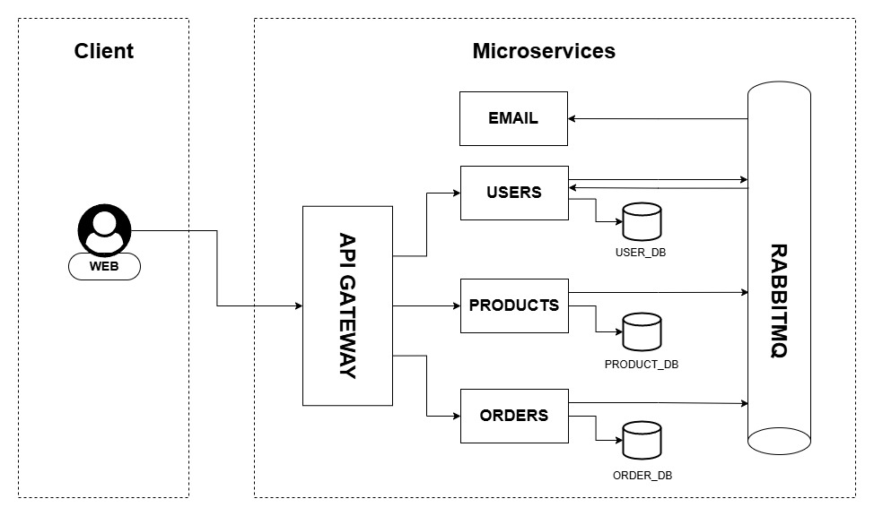
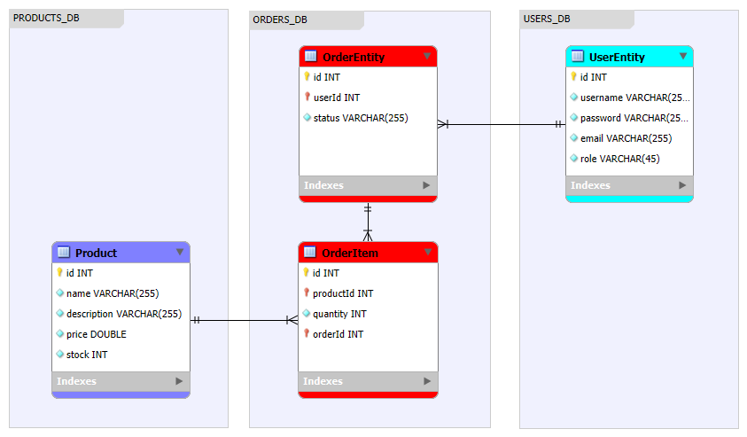
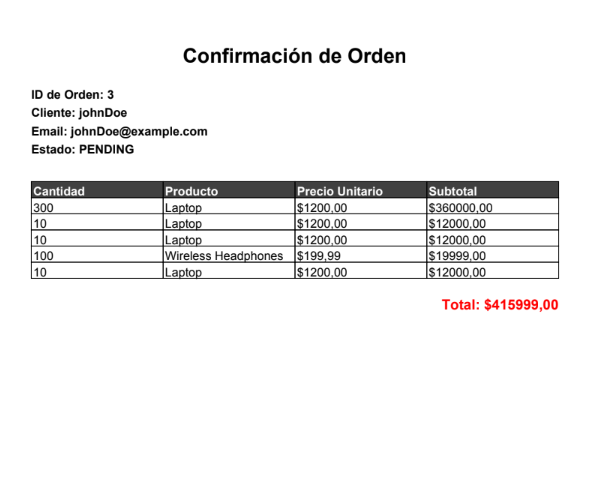

# Arquitectura de Microservicios con Spring Boot

Este repositorio contiene tres microservicios independientes diseñados para gestionar usuarios, productos y pedidos. Cada microservicio se implementa utilizando Spring Boot y sigue una arquitectura modular para manejar responsabilidades específicas.

---

## Resumen
Cada microservicio utiliza una base de datos en memoria H2 para el almacenamiento temporal de datos y expone sus funcionalidades mediante APIs REST, los eventos asincrónicos entre los servicios son gestionados a través de un message broker (RabbitMQ):



- **Microservicio de Usuarios (userMicroservice)**: Administra usuarios y sus roles. Publica eventos cuando un nuevo usuario se registra y consume eventos relacionados con actualizaciones de inventario.
- **Microservicio de Productos (productMicroservice)**: Gestiona el catálogo de productos e inventario. Publica eventos cuando se actualiza el inventario de productos.
- **Microservicio de Pedidos(orderMicroservice)**: Administra los pedidos de los clientes. Publica eventos cuando se crea un nuevo pedido.
- **Microservicio de Correo(emailMicroservice)**: Consume eventos de los otros microservicios, como el registro de usuarios y la creación de pedidos, para enviar correos electrónicos o generar PDFs con la información relevante (por ejemplo, detalles del pedido).
- **API Gateway**: Actúa como intermediario entre el cliente y los microservicios, facilitando la comunicación entre el cliente y los servicios backend.
- **Eureka Server**: Servidor de descubrimiento de servicios que permite la localización dinámica de los microservicios.


### Entidades


---

## Configurar Aplicacion

### Variables de Entorno
Para configurar el emailMicroservice, agrega las siguientes variables en el archivo de configuración de application.properties:

```text
spring.mail.username=${emailName}
spring.mail.password=${emailPassword}
```

Estas variables deben ser definidas en tu archivo .env o en las configuraciones del entorno de tu servidor de aplicaciones.

### Configurar Rabbit

A continuación te detallo los pasos para configurar RabbitMQ y usarlo en tu proyecto:

1. Instalar RabbitMQ
   Localmente:
   Si no tienes RabbitMQ instalado localmente, puedes seguir estas instrucciones:

Usando Docker: Puedes ejecutar RabbitMQ en un contenedor con el siguiente comando:

```text
docker run -d --hostname rabbitmq-host --name rabbitmq -p 5672:5672 -p 15672:15672 rabbitmq:management
```

## Endpoints

### Microservicio de Usuarios
- `GET /users` - Obtener todos los usuarios.
- `POST /users` - Crear un nuevo usuario.
- `GET /roles` - Obtener todos los roles.

### Microservicio de Productos
- `GET /products` - Obtener todos los productos.
- `POST /products` - Crear un nuevo producto.
- `PUT /products/{id}` - Actualizar el stock de un producto.

### Microservicio de Pedidos
- `POST /orders` - Crear un nuevo pedido.
- `GET /orders` - Obtener todos los pedidos.
- `PUT /orders/{id}` - Actualizar el estado de un pedido.
- `POST /orders/{id}/new-item` - Agregar un nuevo ítem a un pedido existente.


## Pasos de prueba

### **Prueba de Creacion de Usuario y Notificacion de creacion:**

Registra un nuevo usuario en el userMicroservice y verifica que el evento UserRegisteredEvent sea correctamente publicado.

Request
```text
http://localhost:8080/api/users
```

Body:
```json
{
   "username": "nuevoUsuario",
   "password": "newpass",
   "email": "nuevoUsuarios@example.com"
}
```

Response - `Code 201`:

```json
{
   "id": 5,
   "username": "nuevoUsuario",
   "email": "nuevoUsuarasios@example.com",
   "roles": "USER"
}
```

Notificacion Email:

```text
> Asunto: Usuario creado nuevoUsuario

¡Gracias por registrarte!

Nombre: nuevoUsuario
Email: nuevoUsuaraios@example.com

Gracias por estar con nosotros.
```

### **Creacion de orden y notificacion por mail con pdf adjunto:**

Puede realizar un pedido a través del orderMicroservice. Este servicio publica un evento OrderCreatedEvent que es consumido por emailMicroservice para generar y enviar una notificación por correo con un PDF adjunto.

Request
Crear Orden
```text
http://localhost:8080/api/orders
```
Crear OrdenItem
```text
http://localhost:8080/api/orders/3/new-item
```

Body:
```json
{
   "userId": 2,
   "status": "PENDING"
}
```

Response - `Code 201`:

```json
{
   "id": 5,
   "product": {
      "id": 2,
      "name": "Laptop",
      "description": "High-performance laptop for professionals",
      "price": 1200.0
   },
   "quantity": 10
}
```

Notificacion Email:

```text
> Asunto:  johnDoe, tu orden ha sido creada

Puedes echar un vistazo a tu orden en el archivo adjunto.

1 archivo adjunto:
```



### **Actualizacion de stock de producto y notificacion por mail:**

Este flujo describe cómo actualizar el stock de un producto en el `productMicroservice`. Cuando el stock cambia, se publica un evento `ProductUpdatedEvent`, que es consumido por `userMicroservice` para enviar una notificación empleando `emailMicroservice`.

Request
Crear Orden
```text
http://localhost:8080/api/products/1/stock?stock=40
```

Response - `Code 200`:

```json
{
   "id": 1,
   "name": "Laptop",
   "stock": 40,
   "price": 1200.0
}
```

Notificacion Email:

```text
> Asunto:  Producto actualizado: Laptop

¡El stock del producto ha sido actualizado!
Nombre: Laptop
Stock: 40
Precio: 1200.0

Gracias por estar con nosotros.
```

---

## Tecnología
- **Spring Boot**: Para el desarrollo de las aplicaciones.
- **Spring Data JPA**: Para el acceso y manejo de datos.
- **Spring Web**: Para la creación de APIs REST.
- **H2 Database**: Base de datos en memoria para pruebas y desarrollo.

